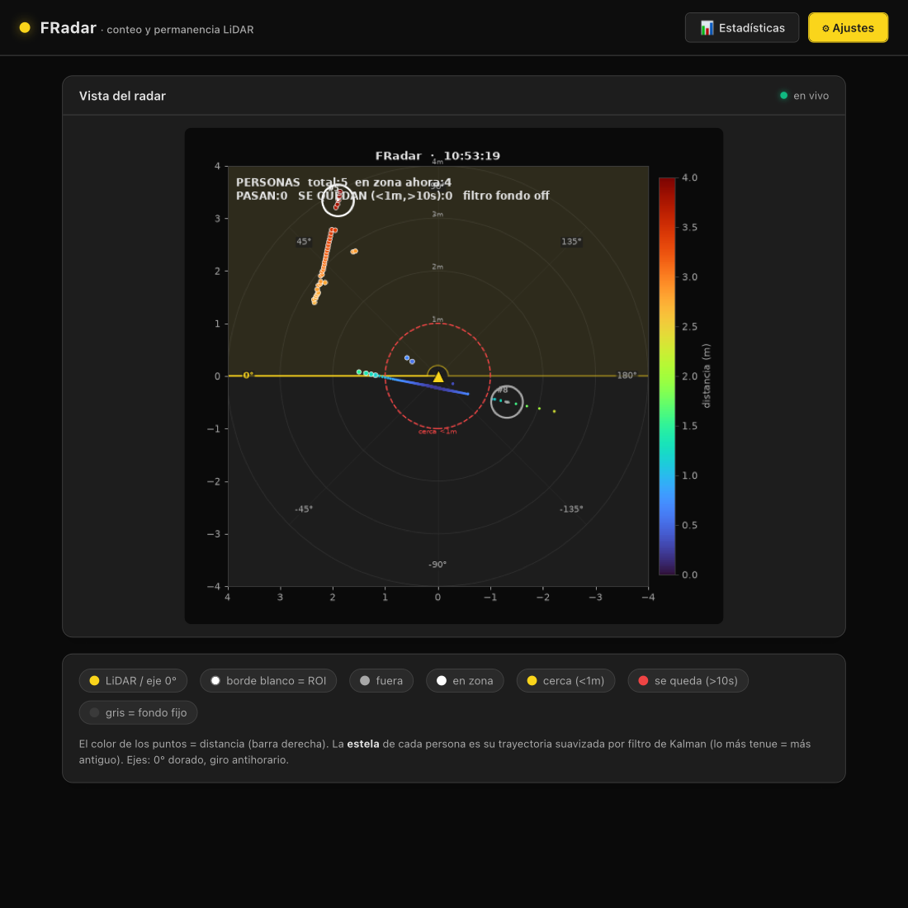
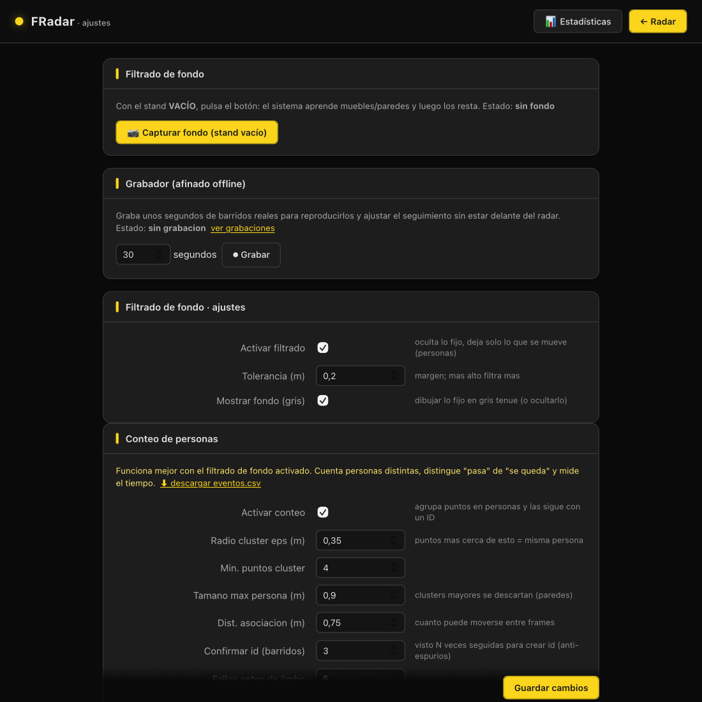
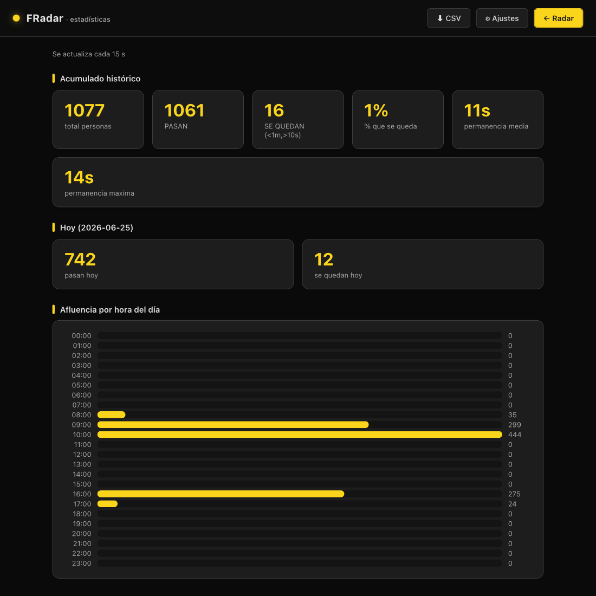

# FRadar — Conteo y permanencia de personas con LiDAR 2D

FRadar usa un **LiDAR 2D YDLidar X2L** para medir, en stands de centros
comerciales, **cuánta gente pasa** cerca del stand y **cuánto tiempo se queda**
(tiempo de permanencia / *dwell time*).

El sistema lee el sensor, filtra el mobiliario fijo, agrupa los puntos en
personas, las sigue con un **ID estable** mediante un **filtro de Kalman +
asignación húngara + re-identificación**, y lo muestra todo en un **panel web
en vivo** con vista cenital tipo radar — incluyendo la **trayectoria (estela)**
de cada persona.



La interfaz sigue el estilo del dashboard de Niage: **tema oscuro con acento
dorado** (`#fad51b`), tipografía Inter y tarjetas redondeadas. Páginas de
**ajustes** y **estadísticas**:

| Ajustes | Estadísticas |
|---|---|
|  |  |

---

## Características

- **Vista cenital en vivo** (panel web Flask) con el LiDAR en el origen, puntos
  coloreados por distancia y barra de color.
- **Zona de interés (ROI)** configurable (rango de ángulos + distancias) delante
  del stand.
- **Zona excluida** (p. ej. el mostrador o el empleado): lo que cae ahí se ignora.
- **Filtrado de fondo**: captura el stand vacío y resta muebles/paredes fijos;
  queda solo lo que se mueve (personas).
- **Detección de personas**: *clustering* DBSCAN sobre los puntos de primer plano.
- **Seguimiento robusto** (`tracker.py`):
  - **Filtro de Kalman** (modelo de velocidad constante) por persona → posición
    suavizada y tolerante al temblor del centroide.
  - **Asignación húngara** (`linear_sum_assignment`) → no intercambia IDs cuando
    dos personas se cruzan.
  - **Confirmación M-de-N** → un ID solo "nace" tras verse en varios barridos.
  - **Re-identificación** → si alguien desaparece (oclusión) y reaparece cerca,
    recupera el **mismo ID**.
- **Trayectorias (estelas)**: se dibuja el recorrido de cada persona uniendo sus
  posiciones suavizadas por Kalman, con lo más antiguo más tenue.
- **Conteo y dwell por persona**: distingue **"pasa"** de **"se queda cerca"**
  (configurable: distancia y segundos) y registra cada evento en `eventos.csv`.
- **Panel de ajustes** (`/settings`) para tocar todo en caliente, sin reiniciar.
- **Grabador**: graba unos segundos de barridos reales para afinar el
  seguimiento offline con `replay.py`.
- Arranca como **servicio systemd**.

---

## Hardware

| Elemento | Detalle |
|---|---|
| Sensor | **YDLidar X2L** — LiDAR 2D 360°, triangulación, single-channel |
| Baudrate | 115200 |
| Giro / muestreo | ~7 Hz · ~3 kHz → **~400 puntos por vuelta** (~0.9°) |
| Alcance | nominal ~8 m; detección fiable de personas ~4–5 m |
| Conexión | placa adaptadora USB-serie (CP210x / CH340) → `/dev/ttyUSB0` |
| Montaje | horizontal, a altura de torso (~1.0–1.2 m), mirando al pasillo |

> Es un LiDAR **2D**: solo ve un plano. Personas en fila india se ocultan entre
> sí. Cristales, espejos y sol directo generan lecturas falsas → de ahí la
> importancia del filtrado de fondo y de mantener la ROI corta (≤3–4 m).

---

## Estructura del repositorio

```
fradar/
├── ydlidar_web.py      # Panel web + hilo del LiDAR + render (aplicación principal)
├── tracker.py          # Tracker: Kalman + húngaro + confirmación M-de-N + re-ID
├── replay.py           # Validación/afinado OFFLINE (escenarios sintéticos o grabaciones)
└── setup_fradar.sh     # Instalador para Raspberry Pi (SDK + venv + systemd)
README.md
DOCUMENTACION_TECNICA.md # Arquitectura, algoritmos, despliegue y datos de los equipos
CLAUDE Ylidar.md         # Notas de proyecto / roadmap original
```

---

## Instalación (Raspberry Pi / Debian / Ubuntu)

El script `setup_fradar.sh` compila el SDK de YDLidar, crea el entorno virtual,
instala dependencias y deja el servicio `systemd` listo:

```bash
# copia setup_fradar.sh y la carpeta fradar/ al equipo, luego:
bash setup_fradar.sh
```

Instalación manual resumida:

```bash
python3 -m venv venv
source venv/bin/activate
pip install numpy matplotlib scikit-learn scipy flask
# + compilar e instalar el binding 'ydlidar' del SDK YDLidar-SDK
```

Dependencias Python: `ydlidar` (binding del SDK), `numpy`, `matplotlib`,
`scikit-learn`, `scipy`, `flask`.

---

## Uso

```bash
source venv/bin/activate
python ydlidar_web.py        # sirve en http://<ip>:8080
```

Como servicio:

```bash
sudo systemctl restart fradar-web      # o ydlidar-web según el equipo
journalctl -u fradar-web -f            # ver logs en vivo
```

### Flujo recomendado

1. Abre el panel en `http://<ip>:8080`.
2. En **/settings**, ajusta la **ROI** mirando el gráfico en vivo.
3. Con el stand **vacío**, pulsa **"Capturar fondo"** y activa el **filtrado de fondo**.
4. Activa el **conteo de personas**.
5. Ajusta `cerca` (distancia) y `se queda` (segundos) a tu caso.

### Leyenda del panel

- ▲ rojo = LiDAR (origen). Color de los puntos = distancia (barra derecha).
- Puntos con borde blanco = dentro de la ROI.
- Gris = mobiliario/paredes fijos (con filtro de fondo).
- Estado de cada persona: **naranja** = fuera · **blanco** = en zona ·
  **amarillo** = cerca (<1 m) · **rojo** = se queda (>10 s).
- La **estela** es la trayectoria suavizada por Kalman (lo más tenue = más antiguo).

---

## Afinado offline (sin LiDAR)

```bash
python replay.py --test                 # escenarios sintéticos (objetivo: 0 saltos de ID)
python replay.py --file grabacion.jsonl # reproduce una grabación real del panel
```

---

## Documentación

Para la arquitectura interna, el detalle de los algoritmos, la referencia
completa de parámetros y los datos de despliegue de los equipos, ver
**[DOCUMENTACION_TECNICA.md](DOCUMENTACION_TECNICA.md)**.
